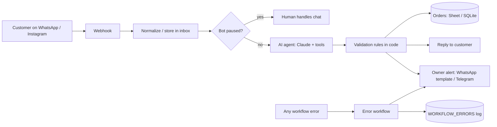

# Architecture

```mermaid
flowchart LR
  C[Customer on WhatsApp / Instagram] --> W[Webhook]
  W --> N[Normalize / store in inbox]
  N --> P{Bot paused?}
  P -- yes --> H[Human handles chat]
  P -- no --> A[AI agent: Claude + tools]
  A --> V[Validation rules in code]
  V --> O[(Orders: Sheet / SQLite)]
  V --> R[Reply to customer]
  V --> X[Owner alert: WhatsApp template / Telegram]
  E1[Any workflow error] --> EW[Error workflow]
  EW --> X
  EW --> L[(WORKFLOW_ERRORS log)]
```

Design choice: the AI talks and decides intent, but prices, totals, stock, phone format and order confirmation are enforced by code.
